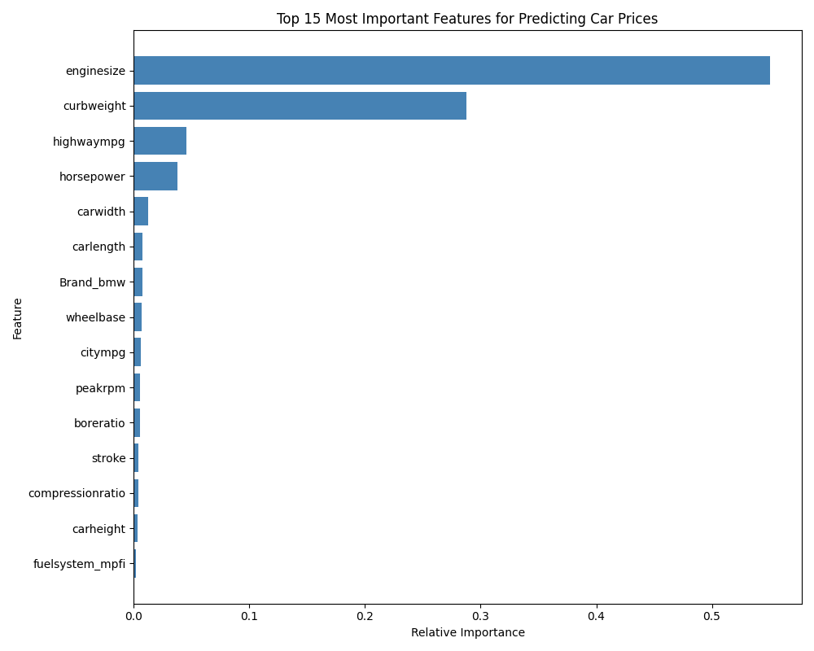
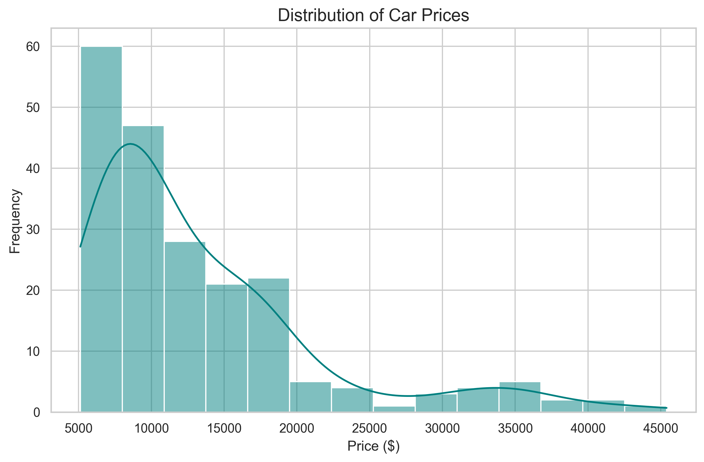
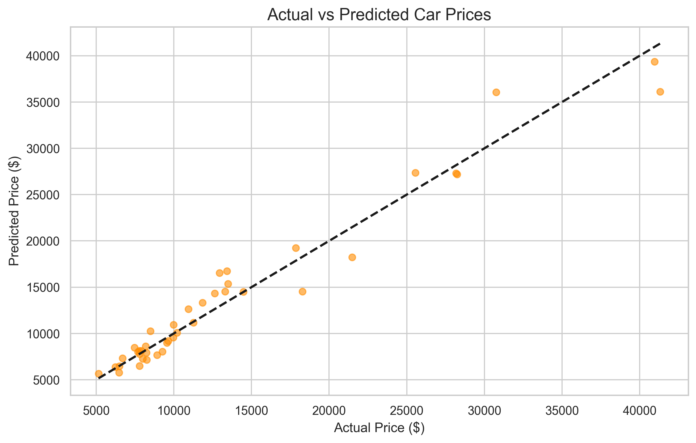
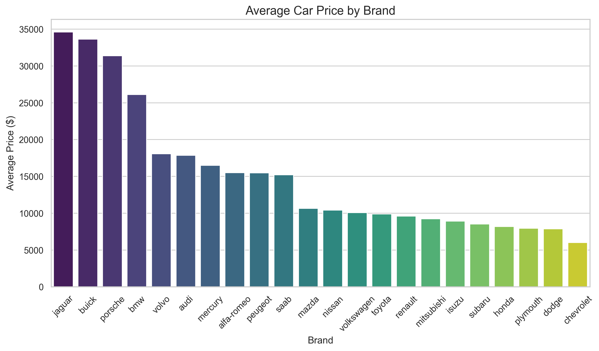

# Car Price Prediction with Machine Learning 🚗💰

This project develops a robust machine learning regression model to predict car prices based on various specifications such as brand goodwill, horsepower, mileage, and engine specifications. The model is trained on the `CarPrice.csv` dataset using a Random Forest Regressor and a scikit-learn preprocessing pipeline.

## 📊 Visual Insights

### 1. Feature Importance
This chart highlights which factors influence the price of a car the most. Enginesize and horsepower emerge as the top predictors.



### 2. Price Distribution
Understand the market range. Most cars in this dataset fall within the $5,000 - $15,000 range.



### 3. Model Accuracy (Actual vs Predicted)
Strong linear correlation between actual market prices and our model's predictions, indicating high reliability.



### 4. Brand Price Analysis
A comparison of average car prices across different manufacturers.



## 🚀 Key Features
- **End-to-End Pipeline**: Includes automated cleaning, feature engineering (brand extraction), and preprocessing.
- **Robust Modeling**: Utilizes a Random Forest Regressor with tuned hyperparameters.
- **High Performance**: Achieving an R-squared (R²) score of **~0.95**.
- **Portable Model**: The trained model is serialized using `joblib` for easy deployment.

## 🛠️ Technology Stack
- **Languages**: Python 🐍
- **Libraries**: Pandas, NumPy, Scikit-learn, Matplotlib, Seaborn, Joblib
- **Environment**: Jupyter Notebook / Python Scripts

## 📈 Model Performance
| Metric | Value |
|--------|-------|
| **R² Score** | 0.9567 |
| **Mean Absolute Error (MAE)** | $1,310.17 |
| **RMSE** | $1,849.58 |

## ⚙️ Project Structure
```text
├── Car_Price_Prediction.ipynb   # Main analysis and modeling
├── CarPrice.csv                 # Raw dataset
├── generate_visuals.py          # Script for README visuals
└── outputs/
    ├── car_price_model.pkl      # Saved model
    └── *.png                    # Project visualizations
```

## 📝 Installation
1. Clone the repository:
   ```bash
   git clone https://github.com/mshahnawaz1202/CodeAlpha_Car-Price-Prediction-with-Machine-Learning.git
   ```
2. Install dependencies:
   ```bash
   pip install pandas scikit-learn matplotlib seaborn joblib
   ```
3. Run the notebook/scripts to reproduce results.
